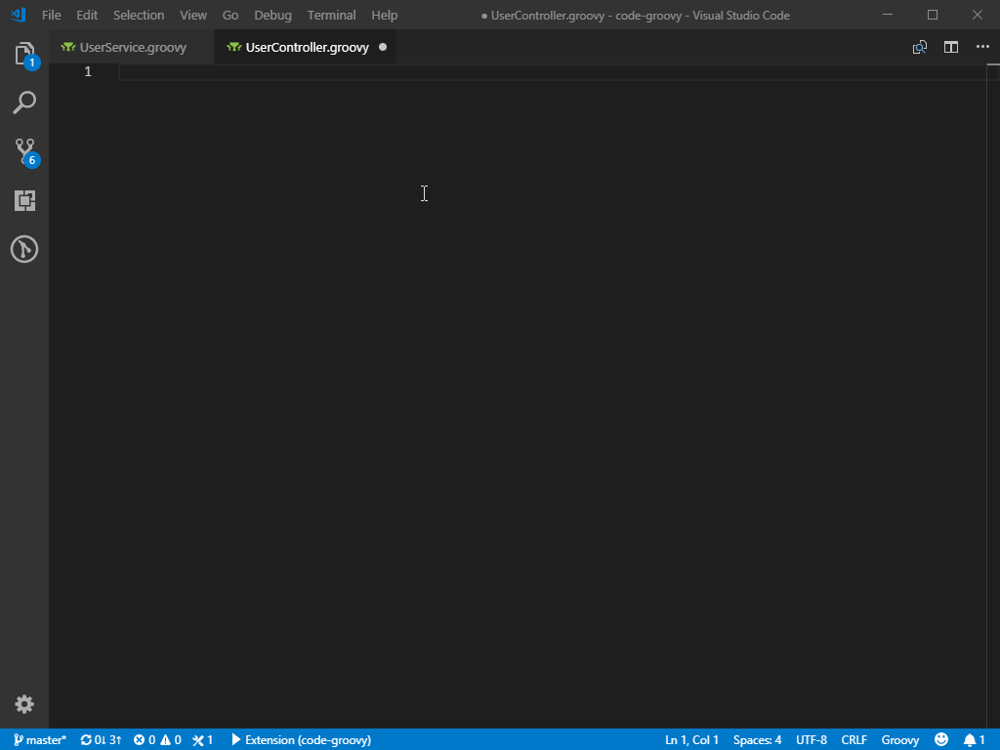

Language support for Groovy &trade; for Visual Studio Code
=====================

Better groovy support for VSCode 

Features
===============

- Groovy organize imports
- Groovy code snippets
- Groovy symbol support

Requirements
===============

Extension Settings
===============

Known Issues
===============

Contributing
===============

This is an open source project open to anyone. Contributions are extremely welcome!

Report any problems you face to the [project](https://github.com/marlon407/code-groovy/issues).

Disclaimer 
===============

Lots of help from [vscode-sort-lines](https://github.com/Tyriar/vscode-sort-lines/).
Groovy symbol based on [vscode-groovy](https://gitlab.com/awl/vscode-grails).