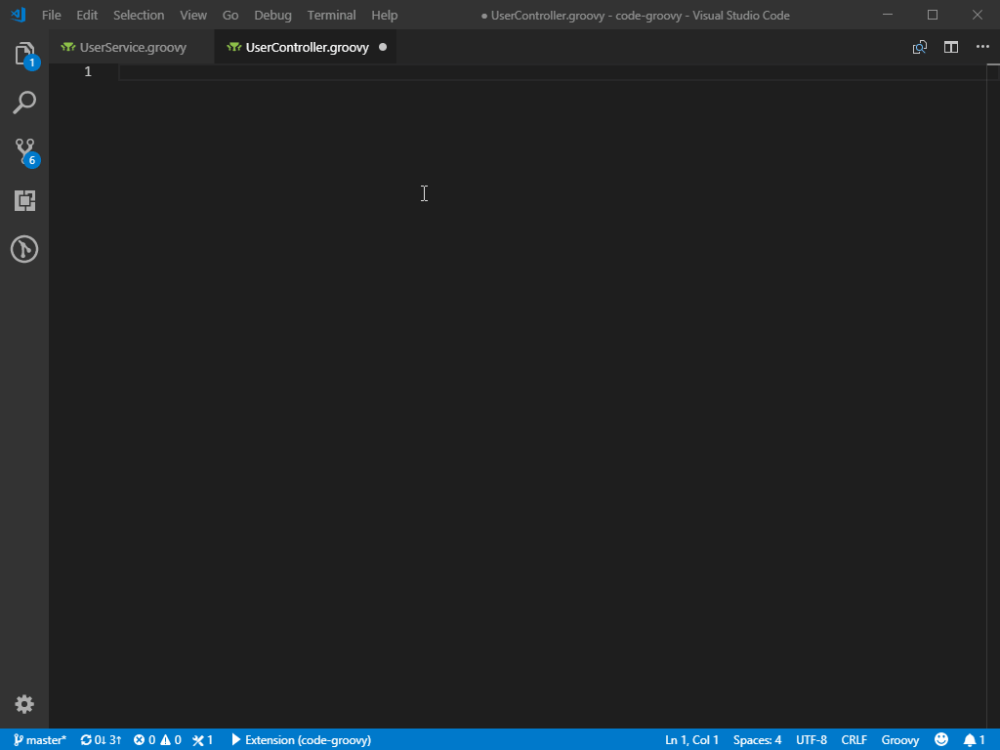

# Code Groovy

Groovy, Grails and GSP language support for Visual Studio Code and Cursor.

[](https://marketplace.visualstudio.com/items?itemName=marlon407.code-groovy)
[](https://marketplace.visualstudio.com/items?itemName=marlon407.code-groovy)
[](https://marketplace.visualstudio.com/items?itemName=marlon407.code-groovy)
[](LICENSE)



## Features

### Navigation

- **Go to Definition** (`Ctrl`/`Cmd` + click, or `F12`) for Groovy classes, methods, services and inherited methods, resolving both workspace sources and the Gradle/Maven JAR classpath — including source JARs when they are available locally.
- **TagLib navigation across files**: jump from `paymentTagLib.method` or `namespace.method` in Groovy, and from `<ns:tag>` or `ns.method` in GSP, straight to the TagLib closure that defines it. Works for Groovy inside `${...}` and `<%...%>` blocks too.
- **Open views and assets from markup**: `Ctrl`/`Cmd` + click on `template=`, `src=` or `url=` in `g:render` and `asset:*` tags. The full attribute value is underlined, and `.scss` sources are preferred over compiled `.css`.
- **Document symbols and outline** covering TagLib closure assignments (`def myTag = { ... }`) and methods with generic return types such as `Map` or `List<Map>`.

### Imports

- **Auto-import** of Groovy and Java types from workspace source and Gradle/Maven JARs, offered both through IntelliSense and as a Quick Fix.
- Suggestions are ranked so workspace types like `Customer` stay above longer JAR names such as `CustomerAccountDTO`.
- New imports are inserted in sorted position without reshuffling existing lines, and out-of-order imports are flagged with a warning.
- **Organize imports** and **organize service injections** commands.

### IntelliSense and editing

- Method completion on member access (`receiver.`) following the same Grails artifact hierarchy used by Go to Definition.
- Completions for Grails `g:` and Asset Pipeline `asset:` tags, with hover documentation linking to the legacy GSP reference.
- Completions for your project's own TagLibs after `namespace:` or `namespace.`, inferring self-closing versus body tags from whether the closure calls `body()`.
- Groovydoc and Javadoc rendered as Markdown on hover.
- Rename (`F2`) for identifiers within the current Groovy file, skipping comments and strings.
- Groovy code snippets.

### Syntax highlighting

- Groovy TextMate grammar with support for slashy strings and Spock quoted method names. `identifier / number` is treated as division, while `= /regex/` still highlights as a slashy string.
- GSP grammar with embedded CSS, JavaScript and Groovy, correct highlighting for Grails tags nested inside HTML open tags, and bracket matching for `[` and `]`.
- HTML language features and Emmet enabled inside `.gsp`, configured so Emmet does not hijack `g.each` or your own `namespace.method` completions.

### Workspace indexing

- Indexes entire workspace source trees and resolves Grails multi-module layouts for go-to-definition fallbacks.
- Progress is reported in the status bar (percentage, current file or JAR, final counts) and in a dedicated **Code Groovy Index** output channel.

## Commands and keybindings

| Command | ID | Keybinding |
| --- | --- | --- |
| Organize imports | `cgroovy.organizeImports` | `Cmd+Shift+O` / `Ctrl+Shift+O` |
| Organize dependences | `cgroovy.organizeDependences` | `Cmd+Shift+D` / `Ctrl+Shift+D` |
| Rebuild Code Groovy Index | `cgroovy.rebuildIndex` | — |
| Show Code Groovy Index Output | `cgroovy.showIndexOutput` | — |

Keybindings are active only while a `.groovy` or `.gsp` editor has focus.

## Settings

| Setting | Default | Description |
| --- | --- | --- |
| `codeGroovy.index.maxSourceFiles` | `0` | Maximum workspace `.groovy` / `.java` files to index when Grails module detection is **not** in use. `0` means no limit. |
| `codeGroovy.modules` | `["domain", "web", "api"]` | Gradle submodules to index when a `settings.gradle` is found. |

## Requirements

Visual Studio Code `1.74.0` or newer, or any recent Cursor build. Syntax highlighting, snippets and GSP support work with no further setup.

Auto-import and go-to-definition against third-party libraries additionally require a populated Gradle or Maven cache on the machine. Resolution is more precise when source JARs have been downloaded.

## Known issues

- Rename is limited to the file currently open; it does not update references across the workspace.
- The default keybindings shadow VS Code's *Go to Symbol in Editor* (`Cmd/Ctrl+Shift+O`) and *Run and Debug* view (`Cmd/Ctrl+Shift+D`) while a Groovy or GSP file is focused. Rebind them in *Keyboard Shortcuts* if you prefer the defaults.
- On very large workspaces the first index can take a while. Narrow it down with `codeGroovy.modules`, or cap it with `codeGroovy.index.maxSourceFiles`.

## Development

```bash
git clone https://github.com/marlon407/code-groovy.git
cd code-groovy
npm install
npm run compile        # or: npm run watch
```

Press `F5` in VS Code to launch an Extension Development Host with the extension loaded.

```bash
npm run test:unit      # unit tests (fast, no editor required)
npm test               # unit tests + integration tests in a VS Code instance
npx vsce package       # build a .vsix
```

## Contributing

This is an open source project open to anyone, and contributions are extremely welcome.

Report any problems you face on the [issue tracker](https://github.com/marlon407/code-groovy/issues).

## License

Licensed under the [MIT License](LICENSE).

## Credits

Lots of help from [vscode-sort-lines](https://github.com/Tyriar/vscode-sort-lines/).

Groovy symbol support based on [vscode-groovy](https://gitlab.com/awl/vscode-grails).
